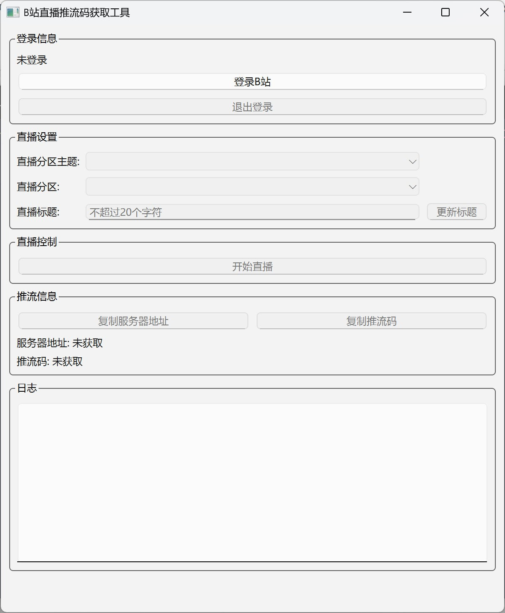
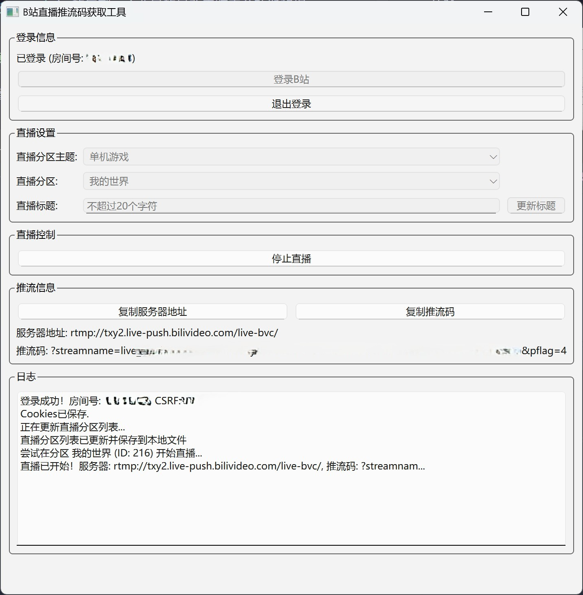

本项目是对 [chaceqc/bilibili_live_stream_code](https://github.com/chaceqc/bilibili_live_stream_code) 的复刻，主要目的是改善跨平台能力和提升 UI 操作体验。

无需 5000 粉丝门槛，通过间接方法获取推流码，从而实现在 OBS 中无门槛开播。

    
    

启动程序后，扫码登录B站，填写直播分区主题、直播分区和标题，点击开始直播获取推流码，粘贴至 OBS 即可开始直播。

直播结束后，点击“结束直播”按钮来结束直播。**只在 OBS 里结束是不行的**。

## 运行方法

### 通过 Release 中的打包文件运行

> 目前仅提供 Windows 平台的打包文件。其他平台可以从源代码运行。

到 [Releases](https://github.com/Eslzzyl/bilibili-live-stream-code/releases) 中下载最新的打包文件，解压运行。

### 通过源代码运行（uv）

克隆仓库：`git clone https://github.com/Eslzzyl/bilibili-live-stream-code.git`

安装 uv：https://docs.astral.sh/uv/getting-started/installation/

安装依赖：`uv sync`

运行：`uv run main.py`

### 通过源代码运行（pip）

克隆仓库：`git clone https://github.com/Eslzzyl/bilibili-live-stream-code.git`

安装依赖：`pip install -r requirements.txt`

运行：`python main.py`
